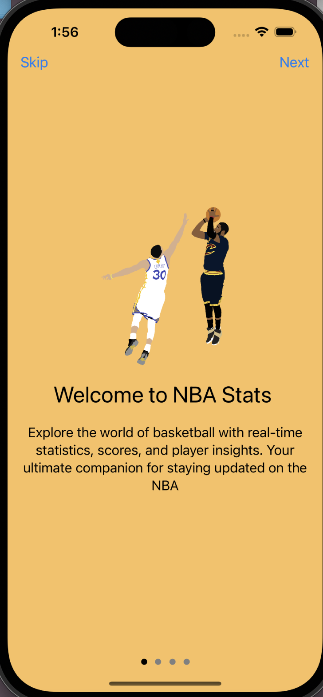
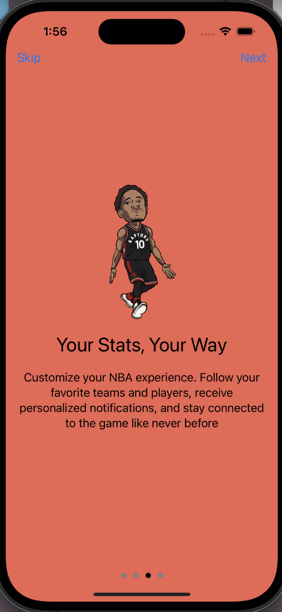

# NBA Stats Plus APP
Welcome to the NBA Stats Plus app! This app provides you with comprehensive NBA information and entertainment.

# Features

1. **Login and Signup**
  - Allows the user to create an account with their email and username
  - Utilizes Google Firebase
  - Users are able to log in with a previously created account
 
2. **Game Schedule**:
   - View the schedule of upcoming games and their timings.
   - Allows users to view real-time scores and the final score of any game.
   - Uses API provided by balldontlie.io
   - Dynamically updates the UITableview to display the corresponding information
 
3. **Standings**:
   - View the standings of the conferences and the league.
   - Uses a Python script that scrapes NBA standing information from FoxSports
   - The data is then stored in a MySQL database, sorted and presented with PHP to a local server
   - The app connects to the URL decodes the JSON information and presents it
  
4. **Reels Tab**:
   - Watch NBA videos curated from Instagram.
   - Our Python script gathers videos from Instagram and displays them here.
   - Uses
   - Relies on AVFoundation to display the videos and update depending on user actions
  
   
# Built With
* **Languages**:
  - Swift: Used for developing the iOS application, including user interface design and app logic.
  - Python: Utilized for backend data processing, including web scraping, data parsing, and interacting with databases.
  - HTML: Used for formatting and presenting data retrieved from the backend in a web-friendly format.
  - SQL: Used for database management, storing structured data collected by the Python backend.
  - PHP: Employed for server-side scripting to format and serve database content as JSON data to the iOS app.

* **Frameworks and Libraries**:
  - Xcode: Integrated development environment (IDE) for Swift development, providing tools for coding, testing, and debugging iOS apps.
  - CocoaPods: Dependency manager for Swift and Objective-C projects, used to easily integrate third-party libraries and frameworks into the iOS app.
  - UIKit: iOS framework providing essential building blocks for constructing user interfaces, handling user interactions, and managing app behavior.
  - pandas: Python library for data manipulation and analysis, utilized for processing scraped NBA data and preparing it for storage.
  - Google Firebase: Backend-as-a-Service (BaaS) platform providing authentication, real-time database, cloud storage, and hosting services for the iOS app.

# App Demo Video
This app relies on a local server for certain functionalities, such as retrieving real-time NBA standings and data. Therefore, it cannot be fully run remotely or on a simulator. However, you can watch a demonstration of the app's features in action on my YouTube channel 
**[here](link_to_youtube_video)**

# Screenshots

* Entry View Controllers

  
  
  

* Login and Signup screens

  
  

* Current Game Screen
* 

  
  

* Standings

  
  
  

* Reels

  
  
  

# License

This project is licensed under the MIT License - see the [LICENSE.md](LICENSE.md) file for details

## Acknowledgments

• Some data is gathered from @ballislife api
