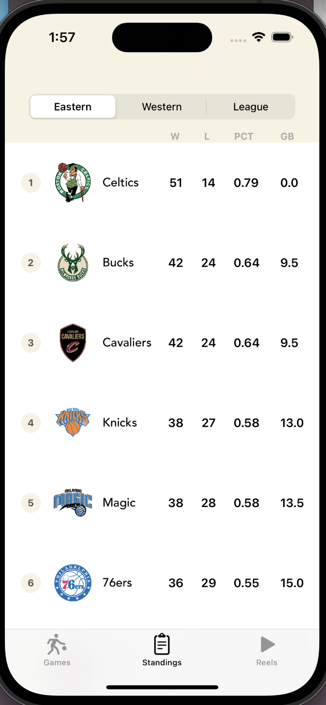
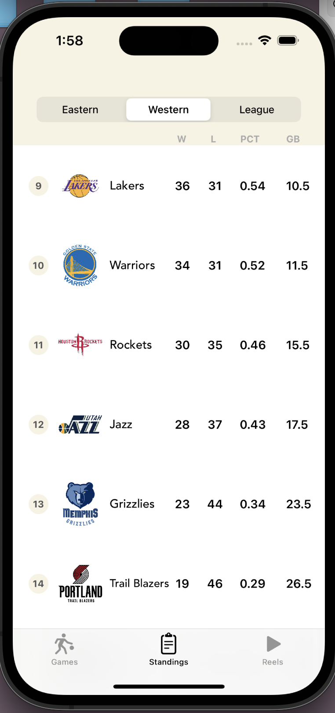

# NBA Stats Plus

IOS that displays NBA data such as current game information, times of each game, standings of each team. I developed a python script that will gather information from @BasketballReference wesbsite for relevant NBA information. The collected information is parsed then store in a MySQL database with another Python program. A PHP script ran locally then displays the information as a JSON format which is retrieved by the IOS app backend. 

# Built With
 
* Languages: Swift, Python, HTML, SQL, PHP
* Frameworks and libraries: XCode, Cocoapods, UIKit, pandas, Google Firebase

# Installation
1. Download code into XCode
2. Connect Iphone and run program through XCode

# Screenshots

* Entry View Controllers

  
  
  

* Login and Signup screens

  
  

* Current Game Screen
* [currentDayGame](Images/todaysGames.png)
* 

* Standings

  
  
  

# License

This project is licensed under the MIT License - see the [LICENSE.md](LICENSE.md) file for details

## Acknowledgments

• Some data is gathered from @ballislife api
